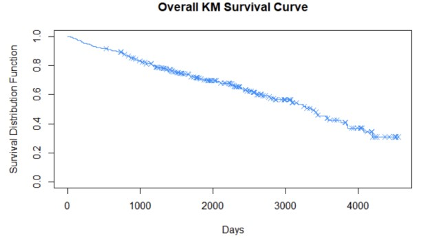

<!DOCTYPE html>
<html lang="en">

<body>
   <header>
      <h1>Modeling Survival of Patients with Cirrhosis</h1>
   </header>
</body>

	

Cirrhosis is severe scarring of the liver. This condition can be caused by many forms of liver diseases and conditions, such as hepatitis or chronic alcohol consumption. Each time your liver is injured, scar tissue forms in the healing process. The accumulation of scar tissue replaces more of the healthy liver tissue as cirrhosis worsens, impairing the liver’s functionality. Advanced cirrhosis can be life-threatening. This project aims to understand the probability of cirrhosis survival and to analyze the underlying factors influencing survival time. A survival analysis was conducted on this dataset using the Kaplan-Meier estimator and curve, Log-Rank tests, and the Cox proportional hazards model.

	<h2>Dataset Information</h2>
	
 The dataset was obtained from the <a href="https://archive.ics.uci.edu/dataset/878/cirrhosis+patient+survival+prediction+dataset-1">UCI Machine Learning Repository</a>, a collection of databases, domain theories, and data generators that are used by the machine learning community for the empirical analysis of machine learning algorithms. It contained 418 observations and 20 variables that featured:

<ul>
	<li>ID</li>
	<li>Number of days between registration and the earlier of death, transplantation or study analysis time</li>
	<li>Status of the patient</li>
	<li>Type of drug: D-penicillamine or Placebo</li>
	<li>Age</li>
	<li>Sex: Male or Female</li>
	<li>Presence of Ascities</li>
	<li>Presence of Hepatomegaly</li>
	<li>Presence of Spiders</li>
	<li>Presence of Edema</li>
	<li>Bilirubin</li>
	<li>Cholesterol</li>
	<li>Albumin</li>
	<li>Copper</li>
	<li>Alkaline Phosphatase</li>
	<li>SGOT</li>
	<li>Tryglicerides</li>
	<li>Platelets per cubic</li>
	<li>Prothrombin time</li>
	<li>Histologic Stage of Disease</li>
</ul>
	

 After removing missing values, there were 276 observations remaining.

	During 1974 to 1984, 424 primary biliary cirrhosis (PBC) patients referred to a Mayo Clinic study were qualified for the randomized placebo-controlled trial testing on the drug D-penicillamine. Of these, 312 patients were followed through the trial and have mostly comprehensive data. The remaining 112 patients did not join the clinical trail, but agreed to record basic metrics and undergo survival tracking. By the end of the study, data was collected from 106 of these individuals along with the initial 312 who were participating in the trial. Penicillamine is a chelating agent that binds to excess copper and removes it from the blood stream. It is often prescribed to treat rheumatoid arthiritis, Wilson’s disease, and kidney stones. If the liver is unable to process substances like iron and copper, they can build up to dangerously high levels and cause cirrhosis as they damage your liver tissues over time. Mutation in particular genes is also suggested to contribute to cirrhosis.

	

	<h2>Kaplan-Meier Estimator and Curve</h2>

After cleaning, the data consists of the survival times or times to event for 276 individuals from the study. The specificity of the data is that they may include censored observations. An observation is censored if it is known that the person survived (or hasn't experienced the event) up to a certain time but nothing is known afterwards. It happens when the individual drops out of the study. 

 Denote by $n_i, i = 1, ..., k$, the number of individuals still alive (or those who have not experienced the event) shortly before time $t_i$ (they are called **at-risk at time** $t_i$), and let $e_i$ be the number of individuals who experienced the event at time $t_i$

The **Kaplan-Meier (KM) product-limit estimator** of the survival function is:

The plot of the KM estimator against time is called the **Kaplan-Meier survival curve**. It is a step function with vertical lines corresponding to the event times. Times when censoring occurs are marked by some symbol. When censoring coincides with an event time, the convention is to put the symbol at the bottom of the step. The KM estimator was computed and the KM curve was plotted using R.

| time | n.risk | n.event | survival |
|------|--------|---------|----------|
| 41   | 276    | 1       | 0.996    |
| 51   | 275    | 1       | 0.993    |
| 71   | 274    | 1       | 0.989    |
| 77   | 273    | 1       | 0.986    |
| 110  | 272    | 1       | 0.982    |
| 131  | 271    | 1       | 0.978    |
| 140  | 270    | 1       | 0.975    |
| 179  | 269    | 1       | 0.971    |
| 186  | 268    | 1       | 0.967    |
| 191  | 267    | 1       | 0.964    |
| 198  | 266    | 1       | 0.960    |
| 216  | 265    | 1       | 0.957    |
| 223  | 264    | 1       | 0.953    |
| 264  | 263    | 1       | 0.949    |
| 304  | 262    | 1       | 0.946    |
| 321  | 261    | 1       | 0.942    |
| 326  | 260    | 1       | 0.938    |
| 334  | 259    | 1       | 0.935    |
| 348  | 258    | 1       | 0.931    |
| 388  | 257    | 1       | 0.928    |
| 400  | 256    | 1       | 0.924    |
| 460  | 255    | 1       | 0.920    |
| 515  | 254    | 1       | 0.917    |
| 549  | 252    | 1       | 0.913    |
| 552  | 251    | 1       | 0.909    |
| 597  | 250    | 1       | 0.906    |
| 611  | 249    | 1       | 0.902    |
| 673  | 248    | 1       | 0.898    |
| 694  | 247    | 1       | 0.895    |
| 733  | 245    | 1       | 0.891    |
| 750  | 243    | 1       | 0.888    |
| 762  | 242    | 1       | 0.884    |
| 769  | 241    | 1       | 0.880    |
| 786  | 240    | 1       | 0.877    |
| 790  | 238    | 1       | 0.873    |
| 797  | 237    | 1       | 0.869    |
| 799  | 236    | 1       | 0.865    |
| 850  | 233    | 1       | 0.862    |
| 853  | 232    | 1       | 0.858    |
| 859  | 231    | 1       | 0.854    |
| 890  | 229    | 1       | 0.851    |
| 904  | 227    | 1       | 0.847    |
| 930  | 226    | 1       | 0.843    |
| 943  | 224    | 1       | 0.839    |
| 974  | 223    | 1       | 0.836    |
| 980  | 222    | 1       | 0.832    |
| 999  | 220    | 1       | 0.828    |
| 1012 | 219    | 1       | 0.824    |
| 1077 | 216    | 1       | 0.820    |
| 1080 | 215    | 1       | 0.817    |
| 1083 | 214    | 1       | 0.813    |
| 1152 | 211    | 1       | 0.809    |
| 1165 | 209    | 1       | 0.805    |
| 1170 | 208    | 1       | 0.801    |
| 1191 | 207    | 2       | 0.793    |
| 1212 | 205    | 1       | 0.790    |
| 1235 | 200    | 1       | 0.786    |
| 1297 | 195    | 1       | 0.782    |
| 1356 | 187    | 1       | 0.777    |
| 1360 | 186    | 1       | 0.773    |
| 1413 | 180    | 1       | 0.769    |
| 1427 | 177    | 1       | 0.765    |
| 1434 | 175    | 1       | 0.760    |
| 1444 | 172    | 1       | 0.756    |
| 1487 | 168    | 1       | 0.751    |
| 1536 | 165    | 1       | 0.747    |
| 1576 | 160    | 1       | 0.742    |
| 1657 | 154    | 1       | 0.737    |
| 1682 | 152    | 1       | 0.732    |
| 1690 | 151    | 2       | 0.723    |
| 1741 | 146    | 1       | 0.718    |
| 1786 | 139    | 1       | 0.713    |
| 1827 | 136    | 1       | 0.707    |
| 1847 | 133    | 1       | 0.702    |
| 1925 | 129    | 1       | 0.697    |
| 2055 | 119    | 1       | 0.691    |
| 2090 | 118    | 1       | 0.685    |
| 2105 | 117    | 1       | 0.679    |
| 2224 | 110    | 1       | 0.673    |
| 2256 | 106    | 1       | 0.667    |
| 2288 | 104    | 1       | 0.660    |
| 2297 | 102    | 1       | 0.654    |
| 2386 | 93     | 1       | 0.647    |
| 2400 | 92     | 1       | 0.640    |
| 2419 | 91     | 1       | 0.633    |
| 2466 | 86     | 1       | 0.625    |
| 2540 | 81     | 1       | 0.617    |
| 2583 | 76     | 1       | 0.609    |
| 2598 | 75     | 1       | 0.601    |
| 2689 | 70     | 1       | 0.593    |
| 2769 | 67     | 1       | 0.584    |
| 2796 | 65     | 1       | 0.575    |
| 2847 | 62     | 1       | 0.566    |
| 3086 | 52     | 1       | 0.555    |
| 3090 | 51     | 1       | 0.544    |
| 3170 | 45     | 1       | 0.532    |
| 3244 | 44     | 1       | 0.520    |
| 3282 | 42     | 1       | 0.507    |
| 3358 | 39     | 1       | 0.494    |
| 3395 | 37     | 1       | 0.481    |
| 3428 | 35     | 1       | 0.467    |
| 3445 | 34     | 1       | 0.453    |
| 3574 | 32     | 1       | 0.439    |
| 3584 | 29     | 1       | 0.424    |
| 3762 | 25     | 1       | 0.407    |
| 3839 | 22     | 1       | 0.389    |
| 3853 | 21     | 1       | 0.370    |
| 4079 | 14     | 1       | 0.344    |
| 4191 | 10     | 1       | 0.309    |

<h2> Log-Rank Test</h2>

To compare two survival curves, we can use the **log-rank test**. The hypotheses are: $H_0: S_1(t) = S_2(t)$ for all values of $t$ vs $H_1: S_1(t) \neq S_2(t)$ for at least one value of $t$. Under the $H_0$, $e_{1i}$ has a hypergeometric distriubtion with parameters $n_i$ (the population size), $n_{1i}$ (the size of the group of interest in the population), and $e_i$) (the sample size). The mean and the variance of $e_{1i}$ are $E(e_{1i})=\frac{n_{1i}e_i}{n_i}$ and $\text{Var}(e_{1i})=\frac{n_{1i}n_{2i}(n_i-e_i)e_i}{n_i^2(n_i-1)}$. 

 The log-rank test statistic is the standardized sum of $e_{1i}$'s over all tables, that is, 

Under $H_0$, this test statistic has approximately a $\mathcal{N}(0, 1)$ distribution. Equivalently, $z^2$ may be chosen as the test statistic. It has approximately a chi-square distribution with one degree of freedom.

The log-rank tests were performed on different patient groups using R at the 5% level:
<li>D-penicillamine vs. Placebo</li>
<li>Male vs. Female</li>
<li>Presence of Hepatomegaly vs. No Presence</li>
<li>Presence of Ascites vs. No Ascites</li> 

### D-penicillamine vs. Placebo

| Chisq on 1 degrees of freedom | P-Value |
|-------------------------------|---------|
|0.4                            |0.5      |

The two-sided P-value is $2P(Z > 0.6325) = 0.5$, hence we fail to reject $H_0$ and conclude that the two survival curves for the D-penicillamine and Placebo groups are not significantly different.

### Male vs. Female

| Chisq on 1 degrees of freedom | P-Value |
|-------------------------------|---------|
|4.5                            |0.03     |

The two-sided P-value is $2P(Z > 2.1213) = 0.03$, hence we reject $H_0$ and conclude that the two survival curves for male and female patients are marginally different. The proportion of females to males must also be taken into consideration when comparing probability of survival between the two groups as there were 242 females and 34 males registered in the study.

### Hepatomegaly vs. No Hepatomegaly

| Chisq on 1 degrees of freedom | P-Value |
|-------------------------------|---------|
|27.1                           |2e-07    |

The two-sided P-value is $2P(Z > 5.2058) = 2e^{-7}$, hence we reject $H_0$ and conclude that the two survival curves for patients with hepatomegaly and those with no hepatomegaly are significantly different. The curve for patients with hepatomegaly lies below that for patients with no hepatomegaly, indicating that presence of hepatomegaly is a risk factor for shorter life span.

### Ascites vs. No Ascites

| Chisq on 1 degrees of freedom | P-Value |
|-------------------------------|---------|
|110                            |<2e-16   |

The two-sided P-value is $2P(Z > 10.4880) = <2e^{-16}$, hence we reject $H_0$ and conclude that the two survival curves for patients with ascites and those with no ascites are significantly different. The curve for patients with ascites lies drastically below that for patients with no ascites, indicating that presence of ascites is a risk factor for shorter life span.

<h2> Cox Proportional Hazards Model </h2>

Suppose that besides the event time and an indicator of censoring, data contain measurements of a set of predictors $x_1, ..., x_m$ that do not vary with time. Denote the event time by $T$ and assume that it is a random variable with the hazard function $h_T(t)$. The <b>Cox proportional hazards model</b> assumes that the hazard function has the form:

Note that in this model, the hazard function depends on time only through the <b>baseline hazard function</b> $h_0(t)$, and therefore, the ratio of hazards of two individuals does not depend on time, which means that the hazards are <b>proportional</b> over time.

The unknowns of this model are the baseline hazard function $h_0(t)$, we introduce another formulation of the Cox PH model, in terms of the survival function. We write:

where $S_0(t) = \exp\left\{- \int_{0}^{t} h_0(u) \, du\right\}$ is the <b>baseline survival function</b>, and $r = exp(\beta_1 x_1 + ... + \beta_m x_m)$ is the <b>relative risk</b> of an individual.

 

The Cox PH model was fit to the data using R, setting drug, age, sex, ascites, hepatomegaly, spiders, edema, bilirubin, cholesterol, albumin, copper, alkaline phosphatase, SGOT, tryglicerides, platelets, prothrombin, and stage as predictors.

|                        | coef     | Pr(>|z|) |
|------------------------|----------|----------|
| drug.relD-penicillamine| 1.7653-01| 0.42003  |
